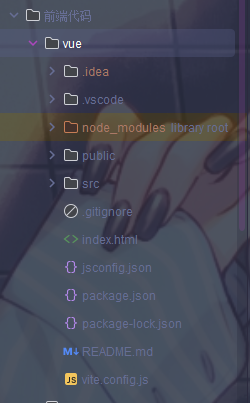
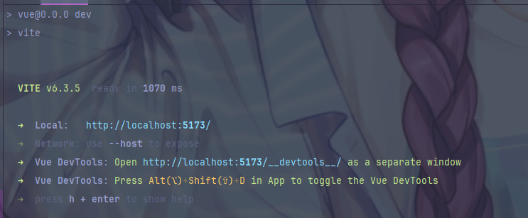
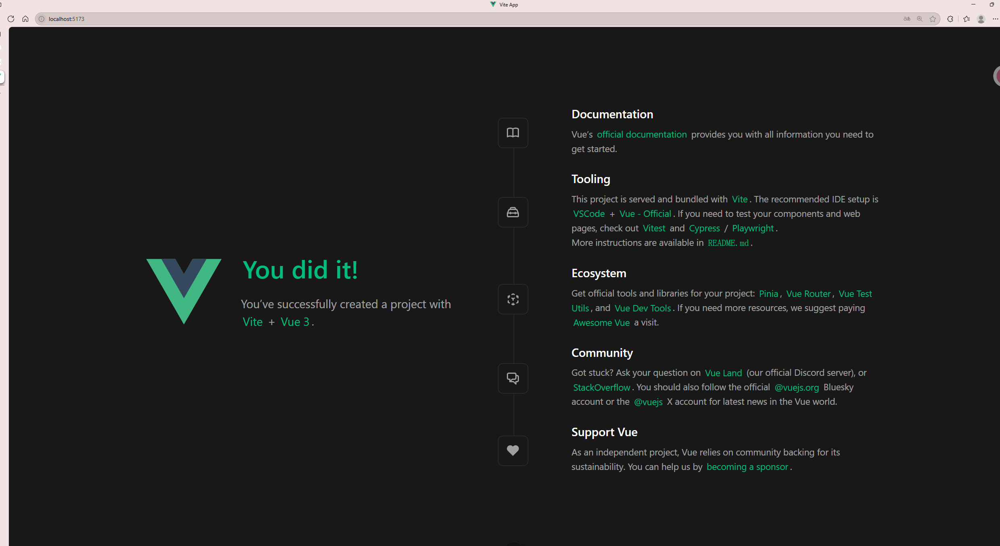

# 6.18日志

## 安装vue3框架

今天开始搭建前端项目，选择了Vue 3作为前端框架。Vue 3具有更好的性能、更小的包体积、更好的TypeScript支持等优势，是构建现代Web应用的理想选择。

### 技术选型
- **Vue 3.5.13**: 最新版本的Vue框架，使用Composition API
- **Vite 6.3.5**: 现代化的构建工具，提供快速的开发体验
- **Vue DevTools**: 开发调试工具
- **JavaScript**: 使用原生JavaScript开发

### 安装过程

使用Vite创建Vue项目，选择Vue 3模板。



**安装命令**：
```bash
npm create vue@latest vue
cd vue
npm install
```

**项目配置**：
- 项目名称：vue
- 版本：0.0.0
- 类型：module
- 私有项目：true

### 遇到问题

#### 网络问题

在安装过程中遇到了严重的网络问题，主要原因是国内访问npm官方源速度较慢。

**问题分析**：
1. 官方源下载速度太慢，基本下载不下来
2. 更换了淘宝源，但使用的是以前的淘宝源，域名过期
3. 需要更新到最新的淘宝源地址

**解决方案**：
1. 检查当前npm源：`npm config get registry`
2. 更换为最新淘宝源：`npm config set registry https://registry.npmmirror.com`
3. 清理npm缓存：`npm cache clean --force`
4. 重新安装依赖：`npm install`

**最终配置**：
- npm源：https://registry.npmmirror.com
- 镜像源：淘宝镜像
- 缓存清理：定期清理避免冲突

### 项目结构

```
vue/
├── public/                 # 静态资源
├── src/                    # 源代码
├── node_modules/           # 依赖包
├── .vscode/               # VS Code配置
├── .idea/                 # IntelliJ IDEA配置
├── package.json           # 项目配置
├── package-lock.json      # 依赖锁定文件
├── vite.config.js         # Vite配置
├── jsconfig.json          # JavaScript配置
├── index.html             # 入口HTML文件
├── .gitignore             # Git忽略文件
└── README.md              # 项目说明
```

### 依赖配置

项目使用npm管理依赖，主要依赖包括：

**生产依赖**：
- vue: ^3.5.13

**开发依赖**：
- @vitejs/plugin-vue: ^5.2.3
- vite: ^6.3.5
- vite-plugin-vue-devtools: ^7.7.2

## 运行vue3

成功安装并配置Vue 3项目后，启动开发服务器进行测试。

### 开发服务器启动

使用Vite开发服务器，提供热重载和快速构建功能。



**启动命令**：
```bash
npm run dev
```

**构建命令**：
```bash
npm run build
```

**预览命令**：
```bash
npm run preview
```

**服务器信息**：
- 本地地址：http://localhost:5173
- 构建工具：Vite 6.3.5
- 开发模式：热重载

### 项目配置

配置了基本的项目设置，包括Vite配置和JavaScript配置。



**配置内容**：

1. **Vite配置**：设置开发服务器、构建选项
4. **构建优化**：设置代码分割、压缩选项

### 开发环境

- **Node.js**: 16.18.0+
- **npm**: 8.19.2+
- **Vue**: 3.5.13
- **Vite**: 6.3.5
- **Vue DevTools**: 7.7.2

