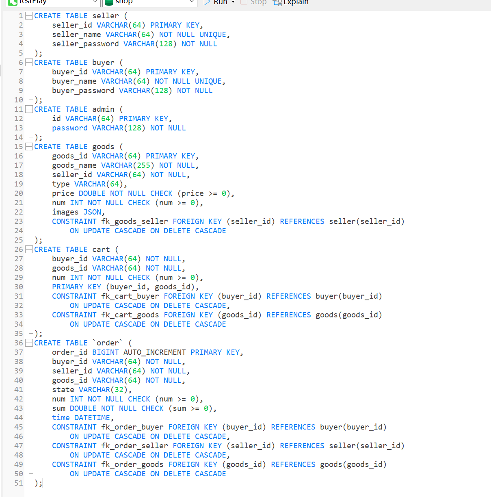
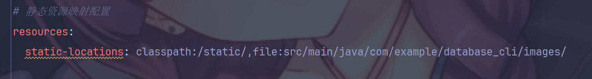
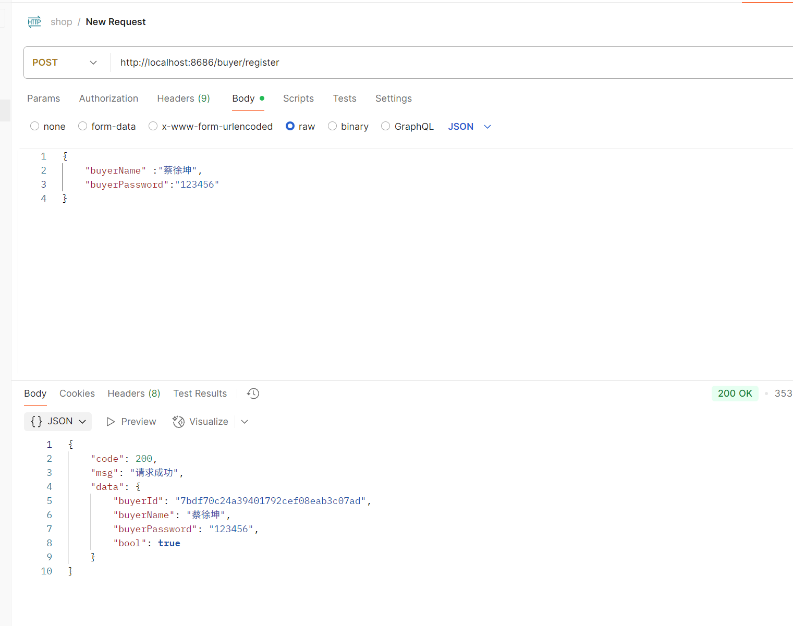
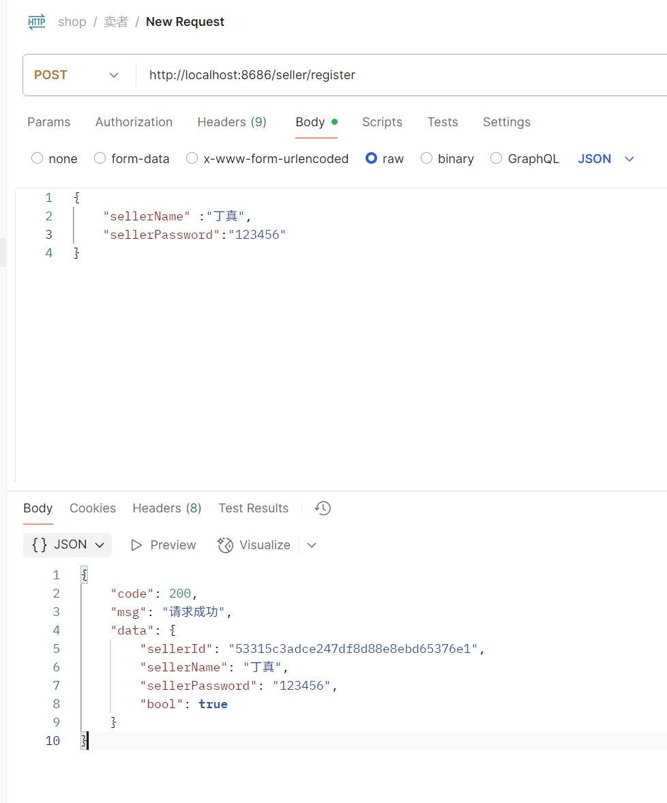

# 6.19日志

#### 使用navicat建表



​	修改了部分最初的设计，建goods表的图片换成了json类型，用来存储图片在后端的相对地址，方便前端直接访问和展示商品图片。

​	在order表中加入了order_id，之前忽略了同一买家可能重复购买同一商品的可能，优化了订单的唯一性和可追溯性。

#### 对images文件夹暴露

​	映射了images文件夹，将其暴露在外，可以让前端直接通过goods表中存储的图片地址进行访问，简化了图片资源的获取流程。



#### 部分接口的测试

##### buyer/register接口
该接口用于买家用户的注册，前端通过POST方式提交买家名称和密码，后端校验信息后写入buyer表，若用户名已存在则返回错误信息。
- **请求参数**：
  - `buyerName` (String)：买家用户名
  - `buyerPassword` (String)：买家密码
- **返回值**：
  - 注册成功时返回Result对象，包含code（int）、msg（String）、data（可为null或买家信息）
  - 注册失败时返回错误信息



##### seller/register接口
该接口用于卖家用户的注册，前端通过POST方式提交卖家名称和密码，后端校验信息后写入seller表，若用户名已存在则返回错误信息。
- **请求参数**：
  - `sellerName` (String)：卖家用户名
  - `sellerPassword` (String)：卖家密码
- **返回值**：
  - 注册成功时返回Result对象，包含code（int）、msg（String）、data（可为null或卖家信息）
  - 注册失败时返回错误信息



#### 订单与商品联动

实现了订单创建功能，创建订单时会自动扣减商品库存，订单初始状态为"待支付"。所有实体表均增加了is_bool字段，实现逻辑删除，查询时只返回未被删除的数据。完善了Goods、Order等相关Mapper的逻辑删除过滤。整体接口已支持前后端联调，数据流转顺畅，接口返回结构清晰，便于后续功能扩展和维护。

# 2025年6月19日 项目开发日志

## 今日完成功能

### 1. 订单支付功能完善
- ✅ 实现了订单支付接口 `/order/pay`
- ✅ 支付时检查订单是否超时（15分钟）
- ✅ 超时订单自动设为"取消"状态
- ✅ 支付成功订单更新状态为"支付成功"

### 2. 超时订单自动处理功能
- ✅ 新增 `handleTimeoutOrders()` 方法，处理超时订单
- ✅ 自动将待支付状态超过15分钟的订单转为"取消"
- ✅ 自动恢复商品库存数量
- ✅ 创建定时任务配置，每5分钟自动执行
- ✅ 提供手动处理接口 `/order/handle-timeout`
- ✅ 创建SQL脚本用于手动处理超时订单

### 3. 前端Element-Plus移除
- ✅ 移除所有element-plus依赖
- ✅ 重写所有Vue组件，使用原生HTML/CSS
- ✅ 创建自定义消息提示组件
- ✅ 修复所有element-plus引用错误

### 4. 订单管理功能扩展
- ✅ 实现OrderMapper所有方法的service层
- ✅ 新增订单查询接口（按买家、卖家、商品、状态等）
- ✅ 新增订单状态更新接口
- ✅ 新增订单删除接口（逻辑删除）

## 技术实现细节

### 超时订单处理逻辑
```java
// 核心处理逻辑
public Result handleTimeoutOrders() {
    // 1. 获取所有待支付订单
    List<Order> pendingOrders = orderMapper.selectByState("待支付");
    
    // 2. 检查每个订单是否超时（>15分钟）
    for (Order order : pendingOrders) {
        if (duration.toMinutes() > 15) {
            // 3. 更新订单状态为取消
            order.setState("取消");
            orderMapper.update(order);
            
            // 4. 恢复商品库存
            Goods goods = goodsMapper.selectById(order.getGoodsId());
            int newNum = goods.getNum() + order.getNum();
            goodsMapper.updateNum(goods.getGoodsId(), newNum);
        }
    }
}
```

### 定时任务配置
```java
@Scheduled(fixedRate = 300000) // 每5分钟执行
public void handleTimeoutOrders() {
    orderService.handleTimeoutOrders();
}
```

### SQL脚本处理
```sql
-- 一键处理超时订单
UPDATE goods g
INNER JOIN `order` o ON g.goods_id = o.goods_id
SET 
    g.num = g.num + o.num,
    o.state = '取消'
WHERE o.state = '待支付' 
  AND TIMESTAMPDIFF(MINUTE, STR_TO_DATE(o.time, '%Y-%m-%d %H:%i:%s'), NOW()) > 15;
```

## 接口文档

### 订单支付接口
- **URL**: `POST /order/pay`
- **参数**: `orderId` (String) - 订单ID
- **返回**: 
  - 成功: `{"code": 200, "msg": "支付成功"}`
  - 超时: `{"code": 400, "msg": "订单已超时，已取消"}`
  - 失败: `{"code": 400, "msg": "订单状态不是待支付，无法支付"}`

### 处理超时订单接口
- **URL**: `POST /order/handle-timeout`
- **参数**: 无
- **返回**: 
  - 成功: `{"code": 200, "msg": "处理完成：X个订单已取消，Y个商品库存已恢复"}`
  - 失败: `{"code": 400, "msg": "处理超时订单失败：错误信息"}`

## 数据库设计说明

### 订单状态流转
1. **待支付** - 订单创建后的初始状态
2. **支付成功** - 用户成功支付后
3. **取消** - 超时或用户主动取消

### 库存管理
- 创建订单时：商品库存 - 订单数量
- 支付成功时：库存不变
- 订单取消时：商品库存 + 订单数量（恢复）

## 测试建议

### 超时订单测试
1. 创建订单，等待15分钟以上
2. 调用 `/order/handle-timeout` 接口
3. 检查订单状态是否变为"取消"
4. 检查商品库存是否恢复

### 支付功能测试
1. 创建订单后立即支付（应成功）
2. 创建订单后等待16分钟再支付（应失败，订单已取消）
3. 对已支付订单再次支付（应失败）

## 下一步计划
- [ ] 完善订单查询接口的controller层
- [ ] 添加订单统计功能
- [ ] 实现订单退款功能
- [ ] 优化定时任务性能
- [ ] 添加订单处理日志记录