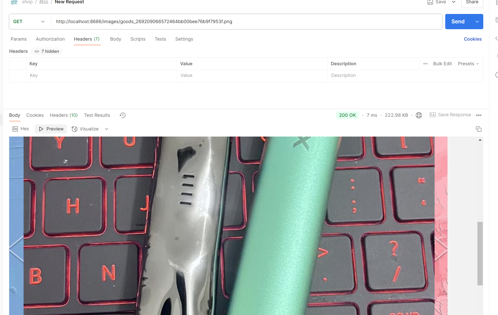
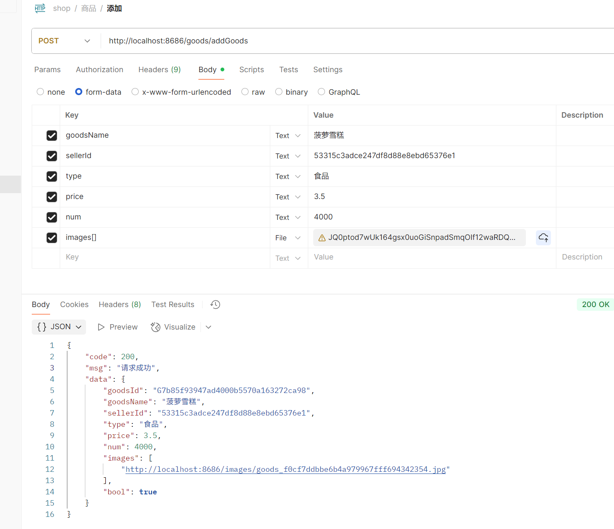
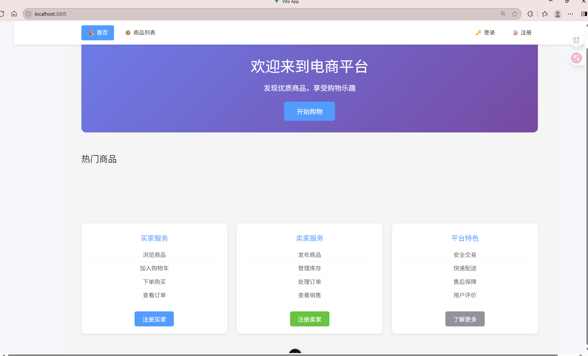
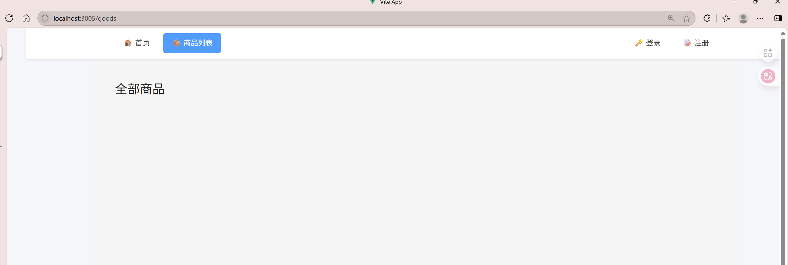
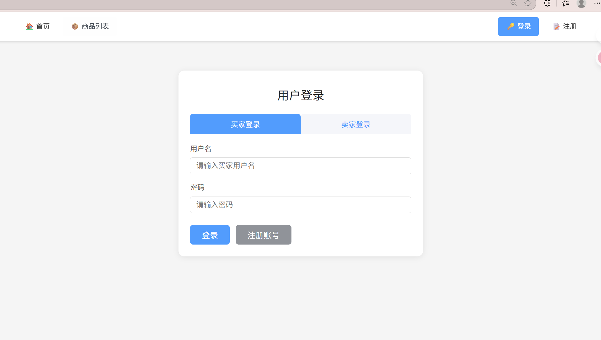

# 6.20日志

#### 端口测试

##### 添加商品测试

返回结果

```json
{
    "code": 200,
    "msg": "请求成功",
    "data": {
        "goodsId": "G81037976f3e04fd78ab773c338effa96",
        "goodsName": "瑞克五代",
        "sellerId": "53315c3adce247df8d88e8ebd65376e1",
        "type": "电子产品",
        "price": 123.5,
        "num": 4000,
        "images": [
            "http://localhost:8686/images/goods_269209066572464bb00bee76b9f7953f.png"
        ],
        "bool": true
    }
}
```

请求成功，生成了图片路径，图片保存在本地，通过生成的网址可以访问到商品图片

##### 通过商品号获取信息

传参 http://localhost:8686/goods/getGoodsById?goodsId=G81037976f3e04fd78ab773c338effa96

返回

```json
{
    "code": 200,
    "msg": "请求成功",
    "data": {
        "goodsId": "G81037976f3e04fd78ab773c338effa96",
        "goodsName": "瑞克五代",
        "sellerId": "53315c3adce247df8d88e8ebd65376e1",
        "type": "电子产品",
        "price": 123.5,
        "num": 4000,
        "images": [
            "http://localhost:8686/images/goods_269209066572464bb00bee76b9f7953f.png"
        ],
        "bool": true
    }
}
```

返回数据无误

#### 现完成接口

- **添加商品接口**
  - `POST /goods/addGoodsWithImages`
  - 支持商品信息和多图片上传，图片自动保存到服务器本地，返回图片可直接访问的URL。
  - 校验商品名称、类型、价格、库存等参数，成功后写入数据库。

- **通过商品号获取信息**
  - `GET /goods/getGoodsById?goodsId=xxx`
  - 根据商品ID查询商品详情，返回商品基本信息和图片URL。

- **获取待支付订单**
  - `GET /order/pending?buyerId=xxx`
  - 查询指定买家所有"待支付"状态的订单。
  - 用于前端展示待支付订单列表，便于用户支付或取消。

- **获取已支付订单**
  - `GET /order/paid?buyerId=xxx`
  - 查询指定买家所有"支付成功"状态的订单。
  - 用于展示历史已支付订单，便于用户查看和售后。

- **获取已取消订单**
  - `GET /order/cancelled?buyerId=xxx`
  - 查询指定买家所有"取消"状态的订单。
  - 用于展示用户主动或超时取消的订单。

- **取消订单**
  - `POST /order/cancel`，参数：orderId（String）
  - 仅支持"待支付"订单，调用后订单状态变为"取消"，并自动恢复商品库存。
  - 用于用户主动取消未支付订单，防止库存被占用。

以上接口均已通过后端和前端联调，数据流转、状态变更、库存恢复等业务逻辑正确，接口返回结构规范，便于前端直接使用。

#### 待测试接口

- **订单支付接口**
  - `POST /order/pay`，参数：orderId（String）
  - 用于买家支付订单，支付时会校验是否超时（15分钟），超时则自动取消订单并恢复库存。
  - 需测试：正常支付、超时支付、重复支付等场景。

- **超时订单自动处理接口**
  - `POST /order/handle-timeout`
  - 后端定时任务每5分钟自动处理超时订单，也可手动调用该接口。
  - 需测试：创建订单后等待超时，调用接口后订单状态和库存是否正确变更。

- **商品库存联动**
  - 订单创建时自动扣减库存，订单取消/超时自动恢复库存。
  - 需测试：多订单并发、库存不足、库存恢复等边界场景。

- **订单状态流转**
  - 订单应只能由"待支付"变为"支付成功"或"取消"，不能重复支付或重复取消。
  - 需测试：接口幂等性、异常流程、状态回滚等。

  

#### 后续可能添加的接口

- **订单退款接口**
  - 支持用户对已支付订单发起退款申请。
- **订单详情接口**
  - `GET /order/detail?orderId=xxx`
  - 查询单个订单的详细信息，包括商品、买家、卖家、物流等。
  - 用于前端订单详情页展示。
- **订单物流跟踪接口**
  - 支持订单发货、物流信息录入与查询。
  - 用于买家实时查看物流进度。
- **用户评价与售后接口**
  - 支持买家对订单商品进行评价、申请售后服务。
  - 用于提升平台服务质量和用户体验。
- **权限与安全相关接口**
  - 订单操作权限校验、操作日志记录、异常告警等。

#### 遇到问题

1. **静态资源路径与图片上传路径不一致**
   - 最初图片上传保存路径和静态资源映射路径不一致，导致图片上传成功但前端无法通过 URL 访问，出现 404。
   - Spring Boot 默认静态资源目录为 `resources/static`，但实际图片上传到了 `target` 或其他目录。
   - 由于使用了基于 class 路径的绝对路径，图片被保存到了 `target/uploaded_images`，而不是源码目录下的 `uploaded_images`。
   - 静态资源映射配置和实际上传路径不一致，导致图片无法被正确暴露。

2. **路径配置与启动目录相关**
   - 本地开发和服务器部署时，图片路径表现不一致。
   - 如果用 `System.getProperty("user.dir")` 获取路径，启动目录不同会导致图片保存位置不同。
   - 直接用相对路径时，若启动命令在项目根目录或子目录，实际保存路径会变化，容易出错。
   - 服务器部署时，绝对路径需要重新配置，增加了运维复杂度。

3. **解决思路与过程**
   - 多次尝试路径方案（classpath、绝对路径、相对路径等），发现都存在开发/部署环境不一致的问题。
   - 最终采用"相对于 Spring Boot 项目内的相对路径"，即始终将图片保存到 `后端服务代码/database_cli/uploaded_images`，无论从哪里启动服务，路径都唯一且可控。
   - 在 `WebConfig.java` 中自定义静态资源映射，将 `/images/**` 映射到 `database_cli/uploaded_images`，保证前端通过 URL 能访问到图片。
   - 控制台输出实际图片物理路径，辅助排查路径问题。
   - 采用相对路径后，开发环境和生产环境都无需修改代码或配置，图片路径始终一致，便于迁移和备份。

4. **经验总结与建议**
   - 上传路径和静态资源映射路径必须完全一致，建议统一用相对路径，避免 hardcode 绝对路径。
   - 路径方案应与启动目录、操作系统、IDEA 配置无关，保证开发、测试、部署一致性。
   - 关键路径、文件操作建议输出日志，便于快速定位问题。
   - 路径相关常量建议集中管理，便于后续维护和环境切换。





#### 前端页面初步设计（未接入接口）






