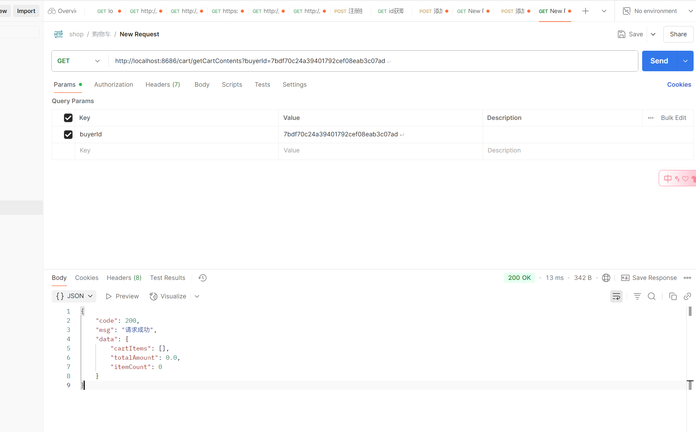

#  6.21日志

#### 接口测试

##### 加入购物车

请求参数http://localhost:8686/cart/addToCart?buyerId=7bdf70c24a39401792cef08eab3c07ad&goodsId=G81037976f3e04fd78ab773c338effa96&num=12

返回参数

```
{
    "code": 200,
    "msg": "请求成功",
    "data": "商品已添加到购物车"
}
```


#### 获取购物车信息

请求信息http://localhost:8686/cart/getCartContents?buyerId=7bdf70c24a39401792cef08eab3c07ad

返回参数

```
{
    "code": 200,
    "msg": "请求成功",
    "data": {
        "cartItems": [],
        "totalAmount": 0.0,
        "itemCount": 0
    }
}
```



接口存在问题，疑似无法获取到商品信息

待解决

