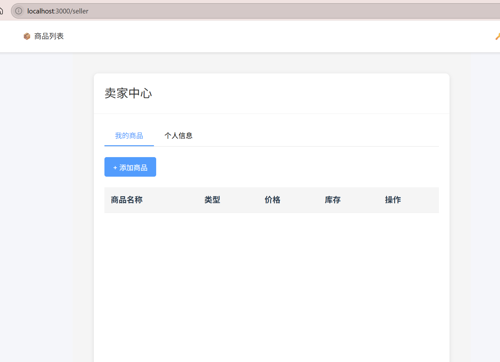

# 6.22日志

#### 连接了部分前端接口

##### 买家登录部分



##### 商品展示部分


##### 商品筛选部分


#### 遇到问题

##### 跨域问题

修改了后端的cors设置，解决了问题


```java
package com.example.database_cli.config;

import org.springframework.context.annotation.Bean;
import org.springframework.context.annotation.Configuration;
import org.springframework.web.cors.CorsConfiguration;
import org.springframework.web.cors.UrlBasedCorsConfigurationSource;
import org.springframework.web.filter.CorsFilter;

@Configuration
public class CorsConfig {

    @Bean
    public CorsFilter corsFilter() {
        CorsConfiguration corsConfiguration = new CorsConfiguration();
        
        // 允许cookies跨域
        corsConfiguration.setAllowCredentials(true);
        
        // 允许的请求头字段
        corsConfiguration.addAllowedHeader("*");
        
        // 允许的HTTP方法
        corsConfiguration.addAllowedMethod("*");
        
        // 使用allowedOriginPatterns替代allowedOrigin，支持通配符
        corsConfiguration.addAllowedOriginPattern("*");
        
        // 允许暴露的响应头
        corsConfiguration.addExposedHeader("*");
        
        // 预检请求的有效期，单位为秒
        corsConfiguration.setMaxAge(3600L);
        
        UrlBasedCorsConfigurationSource source = new UrlBasedCorsConfigurationSource();
        source.registerCorsConfiguration("/**", corsConfiguration);
        
        return new CorsFilter(source);
    }
}
```

#### 商品图片不显示问题

暂未解决