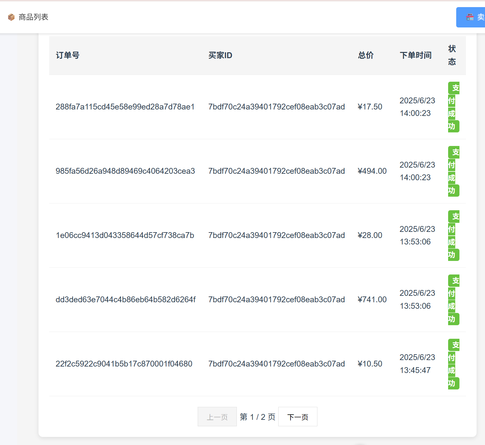

# 6.23日志

#### 解决了前端订单不显示的问题

排查了后端问题，发现了在最初设计时订单未加入订单号，后面再数据库和实体类加入了order_id但MyBatis的xml映射中并未修改，使得在使用数据库出现问题

#### 解决了商品图片不显示的问题

图片映射问题，映射在跟目录的图片文件夹，但是在最外层启动的项目，所有映射在最外层，使用在后端文件夹中单独启动，成功映射到正确的文件夹

#### 实现了购物车的批量结算

循环执行创建订单的功能，创建成功的购物车中会清除，全部创建完成后会跳转到订单界面

#### 实现了订单信息的分页

最初的设计并没有考虑分页的问题，所有添加了分页功能，使用了数据库内的分页方法，后遇到了不知道总页数的问题，而且有不想修改结构，就使用map对原有的返回进行了包装，将总数传给前端从而让其获取总页数

#### 设计了管理员界面

设计了管理员界面，没有在主界面保留跳转方式，只能用网址访问

管理员界面没有包留注册的方式，不对外提供注册方式

遇到问题，登录接口存在问题，设计出没有设计昵称，添加后未在mapper的映射文件中修改，

