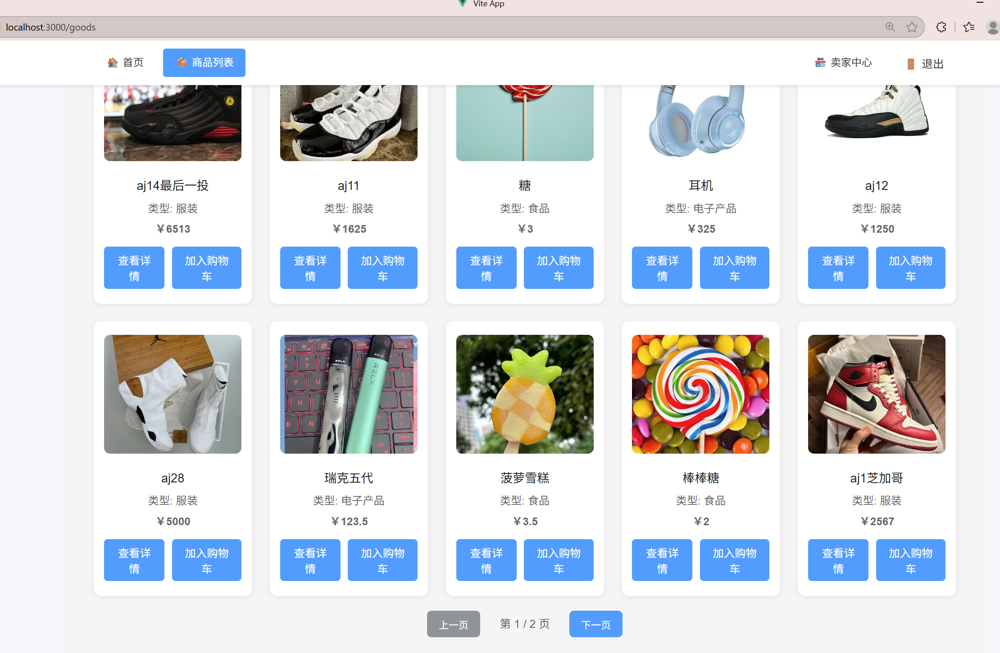
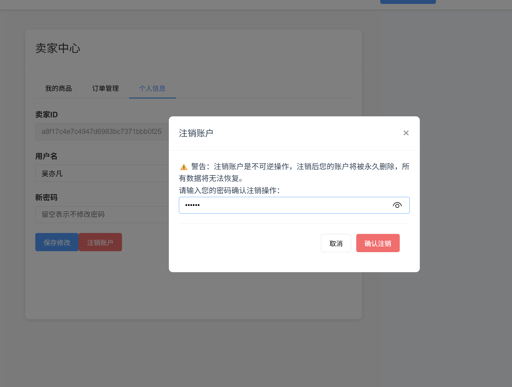
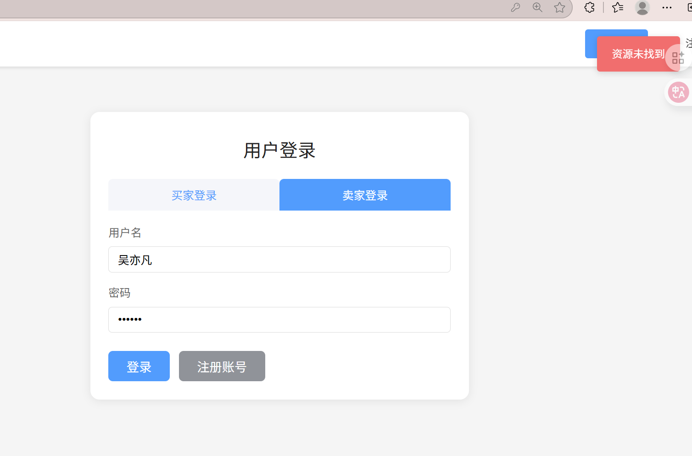
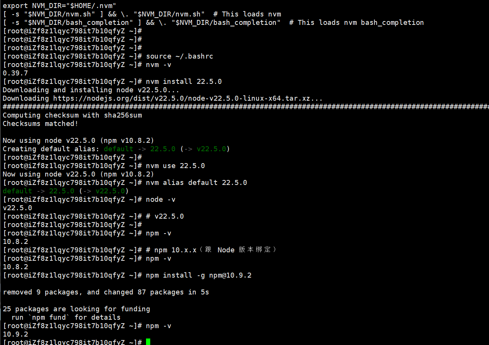
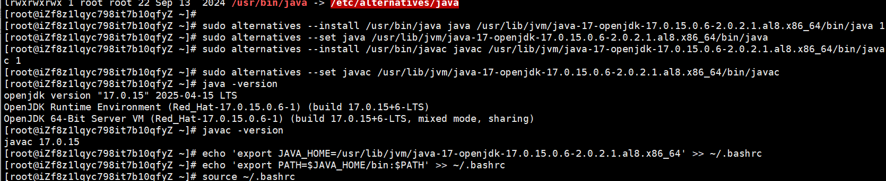
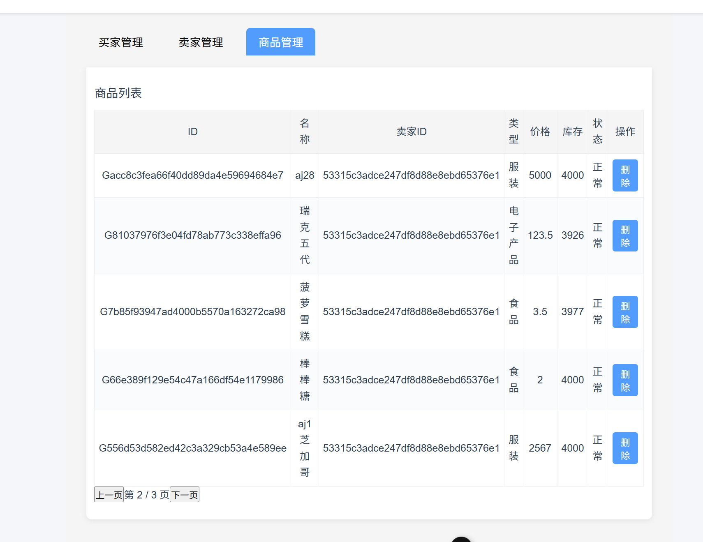

# 6.24日志

#### 实现了前端商品界面的分页

#### 实现了注销操作

遇到问题，先前将注销的实现空了下来，因为要作隐性删除，但未想好如何实现，先前端执行注销时后端相应但未处理数据库，具体隐性删除设计是在表中加入了一位标记为is_bool用来记录是否删除

#### 实现了管理员的对数据删除和恢复功能

遇到问题，状态一直显示已删除，经检查，将buyer对象展示在前端发现将状态判断的字段isBool错误的映射了bool，后将isBool修改成bool解决

#### 在服务器上安装node.js和调整npm版本

#### 更换服务器上的java版本

下载jdk17后删除原有的jdk11，之后用命令强制吧jdk17设置为使用的jdk版本

#### 给商品数量增减的接口使用了悲观锁

主要在查询商品和订单变化出增加了，具体在对应操作加上了@Transactional注解在数据库sql加上了FOR UPDATE

#### 实现了管理界面的分页

