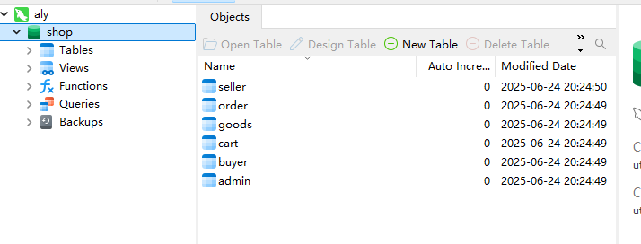
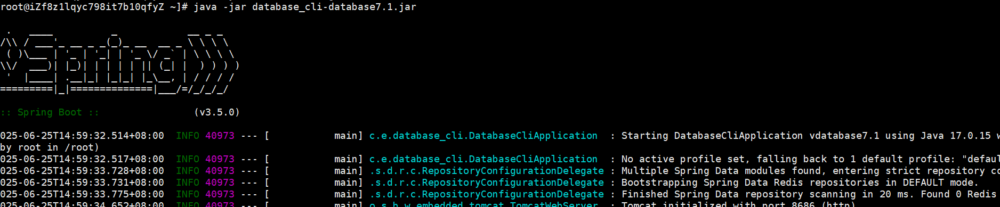

# 6.25日志

#### 部署后端

##### 将本地的数据库通过navicat导入到服务器上的数据库

之前做项目服务器上已经安装了mysql

mysql存在版本问题，常见版本为5和8两个长期支撑的版本

本地和数据库使用的版本不同数据导入可能会出现问题

现全使用8版本

##### java项目运行

更新java为对应版本的jdk，我使用的jdk版本为jdk17，但我服务器本地的jdk版本为jdk11，所有我安装jdk17后卸载了jdk11，但出现了服务器找不到jdk的问题，我用命令强制设置我新安装的jdk17为默认版本

springboot项目成功运行

#### 前端部署

##### 安装node.js,npm

安装后运行前端项目失败，原因是node.js版本过新，后使用了长期支撑版本，去除项目依赖重新下载，后可成功运行

运行后由于访问后端使用localhost访问不到，后重新设了接口的路径为对应网址

安装了nginx，配置后无法运行，放弃了nginx代理

#### 前端界面展示

