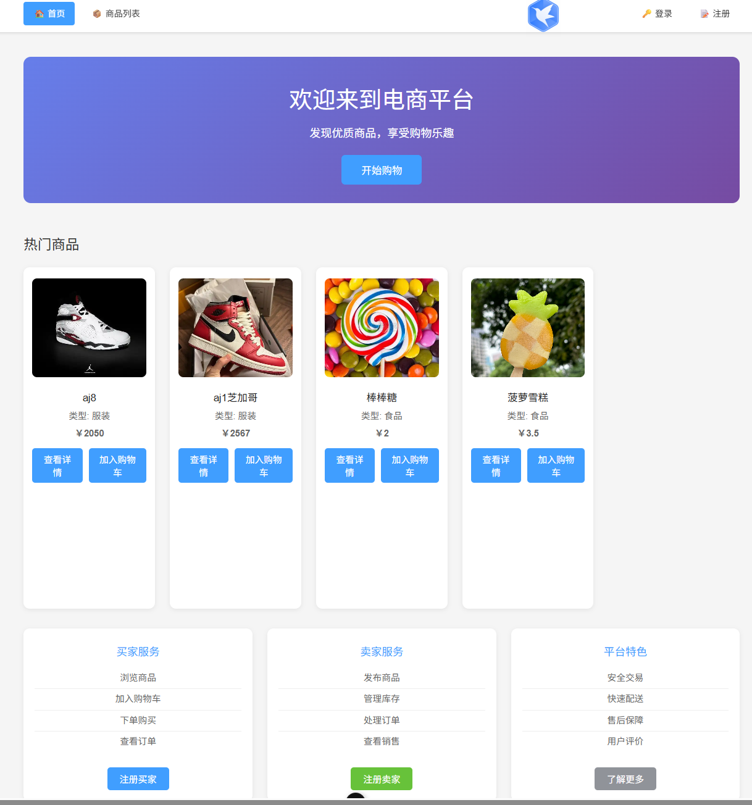
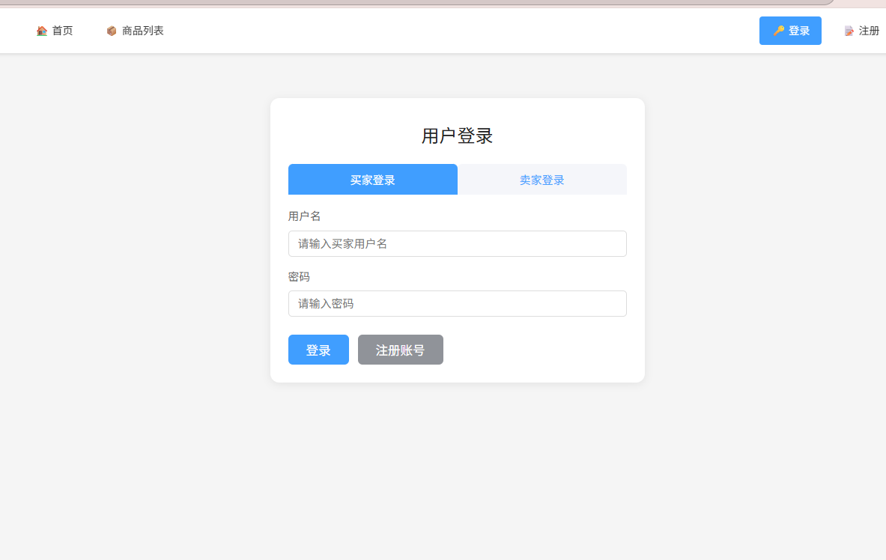

<font size=9>**在线商城系统**</font>


目录

[TOC]


## 一、开发环境介绍

### **使用软件：**

- **前端开发：IntelliJ IDEA 2024.1.6**
- **后端开发：IntelliJ IDEA 2024.1.6**
- **接口测试：postman**

### 前端开发：

- **项目依赖：vue+vuerouter+vuex+bootstrap+@popperjs/core+core-js+jquery**

### 后端开发：

- **开发语言：java**
- **包管理：Maven**
- **项目依赖：mysql-connector-j+lombok+jackson-databind+commons-fileupload+mybatis**

### 服务器：

- 系统：Alibaba Cloud Linux 3.2104 LTS 64位
- 数据库：mysql8
- 部署：直接在服务器上运行

## 二、项目地址

**项目github地址：**https://github.com/asdadasfa/database7


## 三、数据库设计

- **buyer表：买家信息**

  ```mysql
  CREATE TABLE `buyer`  (
    `buyer_id` varchar(64) CHARACTER SET utf8mb4 COLLATE utf8mb4_0900_ai_ci NOT NULL,
    `buyer_name` varchar(64) CHARACTER SET utf8mb4 COLLATE utf8mb4_0900_ai_ci NOT NULL,
    `buyer_password` varchar(128) CHARACTER SET utf8mb4 COLLATE utf8mb4_0900_ai_ci NOT NULL,
    `is_bool` tinyint(1) NOT NULL DEFAULT 1,
    PRIMARY KEY (`buyer_id`) USING BTREE,
    UNIQUE INDEX `buyer_name`(`buyer_name` ASC) USING BTREE
  ) ENGINE = InnoDB CHARACTER SET = utf8mb4 COLLATE = utf8mb4_0900_ai_ci ROW_FORMAT = Dynamic;
  ```

  

- **seller表：卖家信息**

  ```mysql
  CREATE TABLE `seller`  (
    `seller_id` varchar(64) CHARACTER SET utf8mb4 COLLATE utf8mb4_0900_ai_ci NOT NULL,
    `seller_name` varchar(64) CHARACTER SET utf8mb4 COLLATE utf8mb4_0900_ai_ci NOT NULL,
    `seller_password` varchar(128) CHARACTER SET utf8mb4 COLLATE utf8mb4_0900_ai_ci NOT NULL,
    `is_bool` tinyint(1) NULL DEFAULT 1,
    PRIMARY KEY (`seller_id`) USING BTREE,
    UNIQUE INDEX `seller_name`(`seller_name` ASC) USING BTREE
  ) ENGINE = InnoDB CHARACTER SET = utf8mb4 COLLATE = utf8mb4_0900_ai_ci ROW_FORMAT = Dynamic;
  
  ```

  

- **goods表:商品信息**

  ```mysql
  CREATE TABLE `goods`  (
    `goods_id` varchar(64) CHARACTER SET utf8mb4 COLLATE utf8mb4_0900_ai_ci NOT NULL,
    `goods_name` varchar(255) CHARACTER SET utf8mb4 COLLATE utf8mb4_0900_ai_ci NOT NULL,
    `seller_id` varchar(64) CHARACTER SET utf8mb4 COLLATE utf8mb4_0900_ai_ci NOT NULL,
    `type` varchar(64) CHARACTER SET utf8mb4 COLLATE utf8mb4_0900_ai_ci NULL DEFAULT NULL,
    `price` double NOT NULL,
    `num` int NOT NULL,
    `images` json NULL,
    `is_bool` tinyint(1) NOT NULL DEFAULT 1,
    PRIMARY KEY (`goods_id`) USING BTREE,
    INDEX `fk_goods_seller`(`seller_id` ASC) USING BTREE,
    CONSTRAINT `fk_goods_seller` FOREIGN KEY (`seller_id`) REFERENCES `seller` (`seller_id`) ON DELETE CASCADE ON UPDATE CASCADE,
    CONSTRAINT `goods_chk_1` CHECK (`price` >= 0),
    CONSTRAINT `goods_chk_2` CHECK (`num` >= 0)
  ) ENGINE = InnoDB CHARACTER SET = utf8mb4 COLLATE = utf8mb4_0900_ai_ci ROW_FORMAT = Dynamic;
  
  ```

  

- **cart表：购物车信息**

  ```mysql
  CREATE TABLE `cart`  (
    `buyer_id` varchar(64) CHARACTER SET utf8mb4 COLLATE utf8mb4_0900_ai_ci NOT NULL,
    `goods_id` varchar(64) CHARACTER SET utf8mb4 COLLATE utf8mb4_0900_ai_ci NOT NULL,
    `num` int NOT NULL,
    `is_bool` tinyint(1) NOT NULL DEFAULT 1,
    PRIMARY KEY (`buyer_id`, `goods_id`) USING BTREE,
    INDEX `fk_cart_goods`(`goods_id` ASC) USING BTREE,
    CONSTRAINT `fk_cart_buyer` FOREIGN KEY (`buyer_id`) REFERENCES `buyer` (`buyer_id`) ON DELETE CASCADE ON UPDATE CASCADE,
    CONSTRAINT `fk_cart_goods` FOREIGN KEY (`goods_id`) REFERENCES `goods` (`goods_id`) ON DELETE CASCADE ON UPDATE CASCADE,
    CONSTRAINT `cart_chk_1` CHECK (`num` >= 0)
  ) ENGINE = InnoDB CHARACTER SET = utf8mb4 COLLATE = utf8mb4_0900_ai_ci ROW_FORMAT = Dynamic;
  
  ```

  

- **order表：订单信息**

  ```mysql
  DROP TABLE IF EXISTS `order`;
  CREATE TABLE `order`  (
    `order_id` varchar(32) CHARACTER SET utf8mb4 COLLATE utf8mb4_0900_ai_ci NOT NULL,
    `buyer_id` varchar(64) CHARACTER SET utf8mb4 COLLATE utf8mb4_0900_ai_ci NOT NULL,
    `seller_id` varchar(64) CHARACTER SET utf8mb4 COLLATE utf8mb4_0900_ai_ci NOT NULL,
    `goods_id` varchar(64) CHARACTER SET utf8mb4 COLLATE utf8mb4_0900_ai_ci NOT NULL,
    `state` varchar(32) CHARACTER SET utf8mb4 COLLATE utf8mb4_0900_ai_ci NULL DEFAULT NULL,
    `num` int NOT NULL,
    `sum` double NOT NULL,
    `time` datetime NULL DEFAULT NULL,
    `is_bool` tinyint(1) NOT NULL DEFAULT 1,
    PRIMARY KEY (`order_id`) USING BTREE,
    INDEX `fk_order_buyer`(`buyer_id` ASC) USING BTREE,
    INDEX `fk_order_seller`(`seller_id` ASC) USING BTREE,
    INDEX `fk_order_goods`(`goods_id` ASC) USING BTREE,
    CONSTRAINT `fk_order_buyer` FOREIGN KEY (`buyer_id`) REFERENCES `buyer` (`buyer_id`) ON DELETE CASCADE ON UPDATE CASCADE,
    CONSTRAINT `fk_order_goods` FOREIGN KEY (`goods_id`) REFERENCES `goods` (`goods_id`) ON DELETE CASCADE ON UPDATE CASCADE,
    CONSTRAINT `fk_order_seller` FOREIGN KEY (`seller_id`) REFERENCES `seller` (`seller_id`) ON DELETE CASCADE ON UPDATE CASCADE,
    CONSTRAINT `order_chk_1` CHECK (`num` >= 0),
    CONSTRAINT `order_chk_2` CHECK (`sum` >= 0)
  ) ENGINE = InnoDB CHARACTER SET = utf8mb4 COLLATE = utf8mb4_0900_ai_ci ROW_FORMAT = Dynamic;
  
  ```

  

- **admin表：管理员信息**

  ```
  CREATE TABLE `admin`  (
    `id` varchar(64) CHARACTER SET utf8mb4 COLLATE utf8mb4_0900_ai_ci NOT NULL COMMENT '管理员ID',
    `name` varchar(64) CHARACTER SET utf8mb4 COLLATE utf8mb4_0900_ai_ci NOT NULL COMMENT '管理员用户名',
    `password` varchar(128) CHARACTER SET utf8mb4 COLLATE utf8mb4_0900_ai_ci NOT NULL COMMENT '管理员密码',
    `is_bool` tinyint(1) NULL DEFAULT 1 COMMENT '逻辑删除标志',
    PRIMARY KEY (`id`) USING BTREE
  ) E
  ```

  


## 四、后端结构介绍


- config层：配置用，如处理跨域和暴露本地文件

  

  

  ```java
    //跨区处理
  @Override
      public void addResourceHandlers(ResourceHandlerRegistry registry) {
          // 获取当前 module (database_cli) 的绝对路径
          String basePath = System.getProperty("user.dir");
          String imagePath = Paths.get(basePath, "uploaded_images").toString();
          File dir = new File(imagePath);
          if (!dir.exists()) {
              dir.mkdirs();
          }
          registry.addResourceHandler("/images/**")
                  .addResourceLocations("file:" + imagePath + File.separator);
          System.out.println("图片物理路径：" + imagePath);
      }
  ```

  

- control层：用于提供接口

  

  ```java
      /**
       * 添加商品到购物车
       * @param buyerId 买家ID
       * @param goodsId 商品ID
       * @param num 数量
       * @return 添加结果
       */
      @PostMapping("/addToCart")
      public Result addToCart(@RequestParam String buyerId,
                             @RequestParam String goodsId,
                             @RequestParam int num) {
          try {
              log.info("添加商品到购物车: 买家ID={}, 商品ID={}, 数量={}", buyerId, goodsId, num);
              Result result = cartService.addToCart(buyerId, goodsId, num);
              if (result.getCode() != 200) {
                  log.warn("添加商品到购物车失败: {}", result.getMsg());
              }
              return result;
          } catch (Exception e) {
              log.error("添加商品到购物车时发生异常: ", e);
              return Result.fail();
          }
      }
  ```

  

- mapper层：用于与数据库进行映射

  

  ```java
  // 分页查询购物车
      List<Cart> selectByBuyerIdPaged(@Param("buyerId") String buyerId, @Param("offset") int offset, @Param("limit") int limit);
      
  ```

  

- moddel层：用于提供数据的类，如实体类返回类

  

  ```java
  //商品
  @Data
  public class Goods {
      String goodsId;
      String goodsName;
      String sellerId;
      String type;
      double price;
      int num;
      List<String> images;
      boolean isBool=true;
  }
  
  ```

  

- server层：具体的业务实现


```java
//买家注册
@Override
    public Result register(VoBuyer vobuyer) {
        // 参数校验
        if (vobuyer == null || !StringUtils.hasText(vobuyer.getBuyerName())
            || !StringUtils.hasText(vobuyer.getBuyerPassword())) {
            return Result.fail(ResultEnum.ERROR_BADPARMETERS);
        }

        // 检查用户名是否已存在
        Buyer existBuyer = buyerMapper.selectByBuyerName(vobuyer.getBuyerName());
        if (existBuyer != null) {
            return Result.fail(ResultEnum.ERROR_NAMEDUPLICATION);
        }

        // 生成买家ID
        Buyer buyer = new Buyer();
        buyer.setBuyerName(vobuyer.getBuyerName());
        buyer.setBuyerPassword(vobuyer.getBuyerPassword());
        buyer.setBuyerId(UUID.randomUUID().toString().replace("-", ""));
        
        // 保存买家信息
        int result = buyerMapper.insert(buyer);
        if (result > 0) {
            return Result.success(buyer);
        } else {
            return Result.fail(ResultEnum.ERROR_OPERATION);
        }
    }
```

## 五、前端结构介绍

- **api:封装所有与后端交互的 API 请求方法**
  

- **assets:静态资源，如全局样式、图片、SVG 等**

  

- **componente:公共组件（如按钮、提示、图标等），可复用的 Vue 组件**

  

- **router:路由配置，管理页面跳转和路由守卫**

  

- **utils:工具函数、辅助方法**

  

- **view:根组件**

  

## 六、**项目展示**

### 6.1主界面展示

- **首页**

  

- **商品页**

  

- **登录界面:登录后会跳转到首页并更新对应界面**

  

- **注册界面：注册后会跳转到首页**


### 6.2买家界面

- **购物车：结算后会跳转到订单界面**

  

- **订单**

  

- **个人中心**


### 6.3卖家

- **商品：商品可以由卖家添加**

  

  

- **个人信息**


### 6.4管理员

- **登录：只能通过网址进入此页面**

  

- **管理：可以删除与恢复数据**

  


## 七、项目部署

- **通过Maven打包项目成jiar包上传服务器**

  

- **通过命令运行jar包**

  

- **将前端项目上传服务器后通过npm运行**

  **如果使用npm启动的话，需要加-- --host才可以被外界访问**


## 八、证书

蓝桥杯javab组国一


睿抗caip国三


天梯赛团体国三


## 九、项目总结

​	经过此次项目，对springboot的使用相较于从前更加熟悉了，也学习了vue的使用，在服务器上也对linux操作系统更加熟悉，从前生涩的命令也可以不用去查看就可以敲出来了。

​	最后感谢老师的指导和同学对我的帮助。
